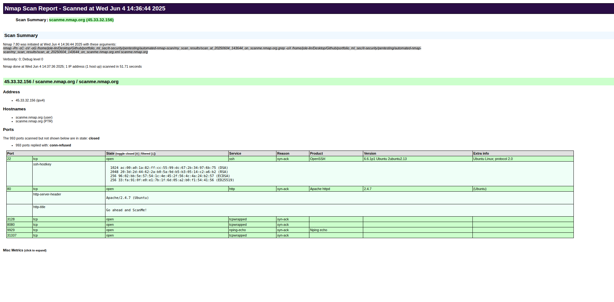

# Automated Nmap Scan

A lightweight Bash wrapper that automates common Nmap tasks for security assessments and network reconnaissance. It scans a given IP address or hostname using Nmap, collects results in both **grepable** and **XML** formats, and optionally converts the XML output into a user-friendly **HTML report** using `xsltproc`.

Nmap (Network Mapper) is a powerful open-source tool used for discovering hosts and services on a computer network by sending carefully crafted packets and analyzing the responses. This script leverages Nmap’s default scripts and version detection (`-sC -sV`) to gather detailed information about open ports, running services, and their versions.

The resulting reports can be used to:
- Identify exposed services and ports on a target system
- Enumerate software versions to detect outdated or vulnerable services
- Generate audit logs or visual summaries for penetration tests
- Document network security assessments in a professional and readable format

## Example report.html screenshot




## Usage

```bash
./scan.sh <target>
```

for example:
```bash
./scan.sh scanme.nmap.org
```

## Requirements

| Tool | Purpose | Install on Debian / Ubuntu |
|------|---------|----------------------------|
| **Nmap ≥ 7.90** | Performs the scan and generates XML / grepable output | `sudo apt install nmap` |
| **xsltproc** (libxslt) | Converts Nmap’s XML to HTML via XSLT | `sudo apt install xsltproc` |
| **nmap.xsl** | Stylesheet used by xsltproc; usually located in `/usr/share/nmap/nmap.xsl` when Nmap is installed | Comes with Nmap |
| **Bash ≥ 4** | Runs the `scan.sh` wrapper script | Pre-installed on most Linux distros |

### Quick install

```bash
sudo apt update
sudo apt install nmap xsltproc
```